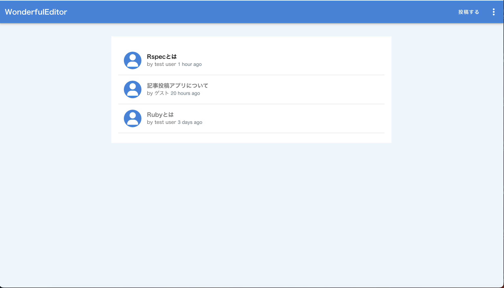
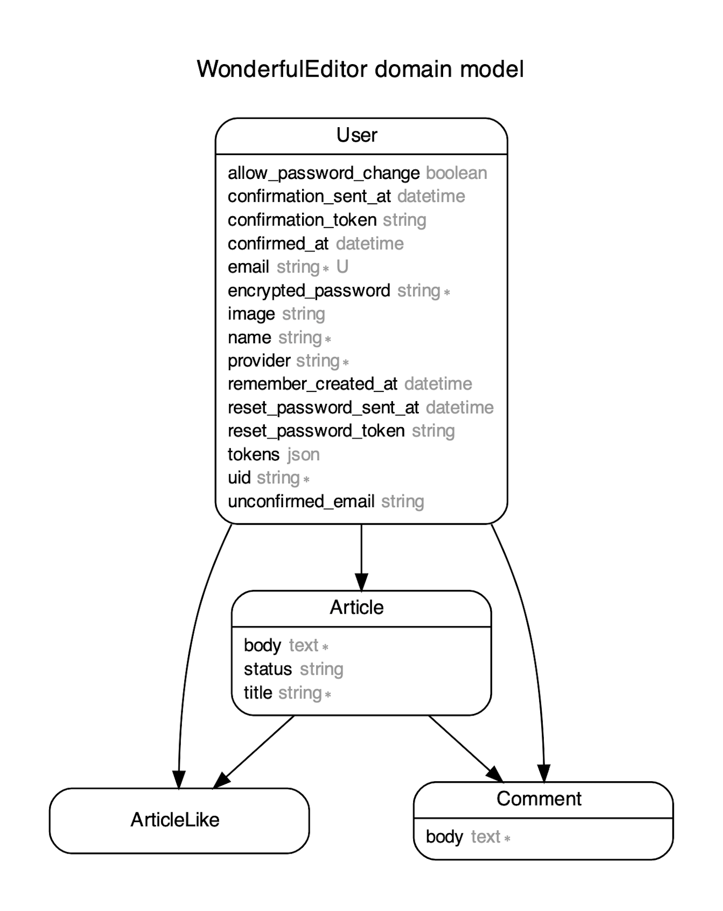

# README
## タイトル
## Wonderful Editor
 『Qlita風記事作成アプリ』

!

## 概要
記事を記録、共有するためのアプリ

## URL・テストアカウント
- ポートフォリオURL: https://wonderful-editor-5tlj.onrender.com/
- ゲストログイン用パスワード
- ユーザー名:ゲスト
- email:guesgues@example.com
- パスワード:guest1

## 使用言語・ツール
- Ruby: 2.7.2
- Rails: 6.0.6.1
- Vue:2.6.1
- DB:postgres
- Docker/Docker-compose
- Rspec

## 制作の意図
「実務を見据えたスキルを学習」を目的として制作しました。転職前に「実務で見やすいドキュメントの作り方」

「わからないことを調べる力」「適切な質問ができる力」こうした自走力を磨くために注力してきました。

具体的には「学習段階では知らない概念や言葉が含まれているような指示をもとにアプリを作る経験」です。

基礎的な学習をした上で、実務で知らないことが出てきた時にどうやって問題解決できるか。

このポートフォリオ作成を通して、その練習をしました。また、このポートフォリオは私が実際に作って、

世に出したいと思うアプリだと考えていません。そのようなアプリは実務を通してスキルアップを図りながら

作った方がより深い学習にもなると考えています。ここまでやってきたことはあくまでも「実務を見据えた学習」

であり、今回のポートフォリオもその一環です。
## テスト
### Rspec
- 単体テスト（Model）
- 結合テスト（Request）

## ER図

